# Flyer UI 项目维护指南

基于 uni-app x 的组件库项目完整维护规范，涵盖开发流程、代码质量、发布管理和团队协作。

## 📚 文档体系概览

### 核心开发规范
- **[EDIT_RULE.prompt.md](./EDIT_RULE.prompt.md)** - UTS 语言核心开发规则
- **[COMPONENT_DEV.prompt.md](./COMPONENT_DEV.prompt.md)** - 组件开发完整指南
- **[POPUP_DEV.prompt.md](./POPUP_DEV.prompt.md)** - 弹窗类组件专项指南
- **[STYLE_DEV.prompt.md](./STYLE_DEV.prompt.md)** - CSS 样式开发规范
- **[TEST_DEV.prompt.md](./TEST_DEV.prompt.md)** - 测试开发策略

### 项目结构规范
```
flyer-ui/
├── .github/                    # GitHub 相关配置
│   ├── prompts/               # 开发规范文档
│   ├── workflows/             # CI/CD 配置
│   └── ISSUE_TEMPLATE/        # Issue 模板
├── components/                # 组件库
│   ├── flyer-actionsheet/     # ActionSheet 组件
│   ├── flyer-button/          # Button 组件
│   ├── flyer-dialog/          # Dialog 组件
│   ├── flyer-icon/            # Icon 组件
│   └── flyer-popup/           # Popup 组件
├── pages/                     # 示例页面
│   ├── examples/              # 组件示例
│   └── index/                 # 首页
├── common/                    # 公共样式
├── static/                    # 静态资源
├── tests/                     # 测试文件
├── docs/                      # 项目文档
└── scripts/                   # 构建脚本
```

## 🚀 开发流程规范

### 1. 新组件开发流程

```mermaid
graph LR
    A[需求分析] --> B[设计评审]
    B --> C[创建分支]
    C --> D[搭建架构]
    D --> E[编写代码]
    E --> F[单元测试]
    F --> G[集成测试]
    G --> H[代码评审]
    H --> I[合并主分支]
    I --> J[发布版本]
```


#### 步骤详解
1. **需求分析** - 分析组件功能需求，参考设计规范
2. **设计评审** - 确定组件 API 设计，遵循项目规范
3. **创建分支** - `git checkout -b feat/component-name`
4. **搭建架构** - 按照 `COMPONENT_DEV.prompt.md` 创建文件结构
5. **编写代码** - 遵循 `EDIT_RULE.prompt.md` 开发规范
6. **单元测试** - 按照 `TEST_DEV.prompt.md` 编写测试
7. **集成测试** - 在示例页面中测试组件功能
8. **代码评审** - 提交 Pull Request，进行 Code Review
9. **合并主分支** - 评审通过后合并到 main 分支
10. **发布版本** - 按版本规范发布新版本

### 2. 分支管理策略
```
main                    # 主分支，稳定版本
├── develop            # 开发分支，集成最新功能
├── feat/component-*   # 功能分支，新组件开发
├── fix/bug-*          # 修复分支，Bug 修复
├── docs/update-*      # 文档分支，文档更新
└── release/v*.*.*     # 发布分支，版本发布
```

#### 分支命名规范
- **功能开发**: `feat/actionsheet-component`
- **Bug 修复**: `fix/button-click-issue`
- **文档更新**: `docs/component-api-update`
- **样式调整**: `style/theme-color-update`
- **性能优化**: `perf/render-optimization`
- **重构代码**: `refactor/store-structure`

### 3. 提交信息规范
```bash
# 格式: <type>(<scope>): <subject>

feat(actionsheet): add new actionsheet component
fix(button): resolve click event not triggered
docs(readme): update installation guide
style(popup): adjust animation timing
perf(icon): optimize icon loading performance
refactor(store): restructure state management
test(dialog): add unit tests for dialog component
chore(build): update build configuration
```

#### 提交类型说明
- **feat**: 新功能
- **fix**: Bug 修复
- **docs**: 文档更新
- **style**: 代码格式调整
- **refactor**: 代码重构
- **perf**: 性能优化
- **test**: 测试相关
- **chore**: 构建或工具链更新

## 🔍 代码质量保证

### 1. 静态代码检查
```json
// .eslintrc.js
{
  "extends": [
    "@vue/typescript/recommended",
    "@vue/prettier",
    "@vue/prettier/@typescript-eslint"
  ],
  "rules": {
    "@typescript-eslint/no-explicit-any": "warn",
    "@typescript-eslint/explicit-function-return-type": "error",
    "vue/component-name-in-template-casing": ["error", "kebab-case"],
    "vue/prop-name-casing": ["error", "camelCase"]
  }
}
```

### 2. 代码格式化
```json
// .prettierrc
{
  "semi": false,
  "singleQuote": true,
  "tabWidth": 2,
  "useTabs": false,
  "trailingComma": "es5",
  "printWidth": 100,
  "bracketSpacing": true,
  "arrowParens": "avoid"
}
```

### 3. Git 钩子配置
```json
// .husky/pre-commit
#!/usr/bin/env sh
. "$(dirname -- "$0")/_/husky.sh"

npx lint-staged
npm run test:unit
```

```json
// lint-staged.config.js
module.exports = {
  "*.{vue,ts,js}": [
    "eslint --fix",
    "prettier --write"
  ],
  "*.{css,scss}": [
    "stylelint --fix",
    "prettier --write"
  ]
}
```

### 4. 持续集成配置
```yaml
# .github/workflows/ci.yml
name: CI

on:
  push:
    branches: [main, develop]
  pull_request:
    branches: [main, develop]

jobs:
  test:
    runs-on: ubuntu-latest
    
    steps:
      - uses: actions/checkout@v3
      
      - name: Setup Node.js
        uses: actions/setup-node@v3
        with:
          node-version: '18'
          cache: 'npm'
          
      - name: Install dependencies
        run: npm ci
        
      - name: Run linting
        run: npm run lint
        
      - name: Run unit tests
        run: npm run test:unit -- --coverage
        
      - name: Run e2e tests
        run: npm run test:e2e
        
      - name: Upload coverage
        uses: codecov/codecov-action@v3
        with:
          file: ./coverage/lcov.info
```

## 📦 版本管理规范

### 1. 语义化版本控制
```
版本格式: MAJOR.MINOR.PATCH

MAJOR: 不兼容的 API 修改
MINOR: 向后兼容的功能新增
PATCH: 向后兼容的问题修正

示例:
1.0.0 - 首个稳定版本
1.1.0 - 新增 Dialog 组件
1.1.1 - 修复 Button 组件 Bug
2.0.0 - API 重大变更
```

### 2. 变更日志管理
```markdown
# Changelog

## [1.2.0] - 2024-01-15

### Added
- 新增 ActionSheet 组件
- 新增 Popup 组件动画配置
- 新增深色主题支持

### Changed
- 更新 Button 组件 API
- 优化组件渲染性能

### Fixed
- 修复 Dialog 组件在 iOS 上的显示问题
- 修复 Icon 组件字体加载错误

### Deprecated
- Button 组件的 `type` 属性将在 v2.0 中移除

### Removed
- 移除了废弃的 Alert 组件

### Security
- 修复 XSS 安全漏洞
```

### 3. 发布流程
```bash
# 1. 确保在 main 分支
git checkout main
git pull origin main

# 2. 运行完整测试
npm run test:all

# 3. 更新版本号
npm version patch|minor|major

# 4. 更新变更日志
# 手动编辑 CHANGELOG.md

# 5. 提交变更
git add .
git commit -m "chore: release v1.2.0"

# 6. 创建标签
git tag v1.2.0

# 7. 推送到远程
git push origin main --tags

# 8. 发布到 npm (如果有)
npm publish

# 9. 创建 GitHub Release
# 通过 GitHub 界面或 CLI 创建
```

## 👥 团队协作规范

### 1. Issue 管理
```markdown
# Bug Report Template
## 描述问题
简要描述遇到的问题

## 复现步骤
1. 
2. 
3. 

## 预期行为
描述你期望发生的情况

## 实际行为
描述实际发生的情况

## 环境信息
- 设备: 
- 系统版本: 
- uni-app 版本: 
- 组件版本: 

## 截图
如有必要，添加截图说明问题
```

```markdown
# Feature Request Template
## 功能描述
简要描述新功能需求

## 使用场景
描述在什么情况下需要此功能

## 详细设计
详细描述功能的设计和实现方案

## API 设计
```ts
// 提供预期的 API 设计
```

## 其他信息
任何其他相关信息
```

### 2. Pull Request 流程
```markdown
# PR Template
## 变更类型
- [ ] Bug 修复
- [ ] 新功能
- [ ] 文档更新
- [ ] 性能优化
- [ ] 代码重构

## 变更描述
简要描述本次 PR 的变更内容

## 相关 Issue
Closes #123

## 测试
- [ ] 单元测试通过
- [ ] 集成测试通过
- [ ] 手动测试通过

## 检查清单
- [ ] 代码遵循项目规范
- [ ] 添加了必要的测试
- [ ] 更新了相关文档
- [ ] 变更不会影响现有功能
```

### 3. Code Review 标准
#### 审查要点
1. **功能正确性** - 代码是否实现了预期功能
2. **代码质量** - 是否遵循编码规范和最佳实践
3. **性能考虑** - 是否存在性能问题
4. **安全性** - 是否存在安全漏洞
5. **可维护性** - 代码是否易于理解和维护
6. **测试覆盖** - 是否有足够的测试覆盖

#### 审查流程
1. **自动检查** - CI 流水线自动运行测试和代码检查
2. **人工审查** - 至少一名团队成员进行代码审查
3. **修改完善** - 根据审查意见修改代码
4. **批准合并** - 审查通过后合并到目标分支

## 📊 项目监控与维护

### 1. 性能监控
```javascript
// 组件性能监控
const performanceObserver = new PerformanceObserver((list) => {
  for (const entry of list.getEntries()) {
    if (entry.entryType === 'measure') {
      console.log(`${entry.name}: ${entry.duration}ms`)
    }
  }
})

performanceObserver.observe({ entryTypes: ['measure'] })

// 组件渲染时间监控
export function measureRenderTime(componentName: string) {
  return {
    start() {
      performance.mark(`${componentName}-render-start`)
    },
    end() {
      performance.mark(`${componentName}-render-end`)
      performance.measure(
        `${componentName}-render`,
        `${componentName}-render-start`,
        `${componentName}-render-end`
      )
    }
  }
}
```

### 2. 错误监控
```javascript
// 全局错误处理
uni.onError((error) => {
  console.error('Global error:', error)
  
  // 上报错误信息
  reportError({
    message: error.message,
    stack: error.stack,
    timestamp: Date.now(),
    platform: uni.getSystemInfoSync().platform,
    version: getCurrentVersion()
  })
})

// 组件错误边界
export function useErrorBoundary() {
  const error = ref<Error | null>(null)
  
  const capture = (err: Error) => {
    error.value = err
    console.error('Component error:', err)
  }
  
  return { error, capture }
}
```

### 3. 使用统计
```javascript
// 组件使用统计
export function trackComponentUsage(componentName: string, action: string) {
  // 统计组件使用情况
  const stats = {
    component: componentName,
    action: action,
    timestamp: Date.now(),
    platform: uni.getSystemInfoSync().platform
  }
  
  // 发送统计数据
  sendAnalytics(stats)
}

// 使用示例
export default {
  mounted() {
    trackComponentUsage('flyer-actionsheet', 'mounted')
  },
  
  methods: {
    handleClick() {
      trackComponentUsage('flyer-actionsheet', 'item-click')
    }
  }
}
```

## 📋 维护检查清单

### 每日维护
- [ ] 检查新的 Issue 和 PR
- [ ] 回复社区问题和讨论
- [ ] 监控 CI/CD 流水线状态
- [ ] 检查错误监控报告

### 每周维护
- [ ] 审查代码质量报告
- [ ] 更新依赖包版本
- [ ] 检查性能监控数据
- [ ] 整理待修复问题清单

### 每月维护
- [ ] 分析使用统计数据
- [ ] 规划下个版本功能
- [ ] 更新文档和示例
- [ ] 进行安全扫描

### 版本发布前
- [ ] 完整回归测试
- [ ] 性能基准测试
- [ ] 兼容性测试
- [ ] 文档更新确认
- [ ] 变更日志完善

## 🎯 质量目标

### 代码质量指标
- **测试覆盖率**: > 80%
- **ESLint 错误**: 0
- **TypeScript 错误**: 0
- **构建成功率**: > 99%

### 性能指标
- **组件渲染时间**: < 16ms
- **包体积增长**: < 10% per version
- **内存使用**: 稳定无泄漏
- **动画帧率**: > 55 FPS

### 用户体验指标
- **Issue 响应时间**: < 24h
- **Bug 修复时间**: < 7 days
- **功能请求处理**: < 30 days
- **文档完整性**: 100%

通过遵循这套完整的维护指南，可以确保 Flyer UI 项目的高质量、高性能和良好的社区体验。
